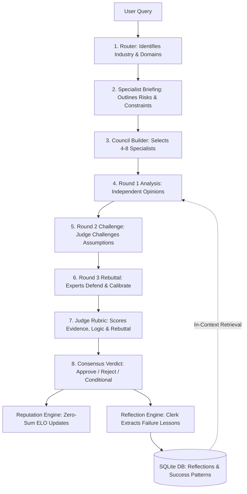

# 🔮 Delphi — Self-Improving Multi-Agent Decision Intelligence Platform

Delphi is a state-of-the-art decision intelligence engine that orchestrates multi-agent deliberation to resolve complex enterprise queries. Moving beyond standard single-prompt LLM predictions, Delphi simulates strategic, multi-disciplinary boards using structured adversarial debate, ELO-inspired reputation tracking, and dynamic in-context memory reflection to output explainable, high-trust consensus verdicts.


---

## 🏛️ System Architecture




---

## 📂 Project Structure

```text
delphi/
├── alembic/              # Database migrations config
├── app/                  # Backend application source code
│   ├── agents/           # LLM agent definitions (expert analysis, rebuttals)
│   ├── analytics/        # Observability logs and metrics database queries
│   ├── api/              # API endpoints (decisions, analytics, health checks)
│   ├── consensus/        # Consensus scoring and synthesis logic
│   ├── core/             # Configuration, logging, exception handlers
│   ├── council/          # Expert council database builder logic
│   ├── database/         # SQLite async sessions and table initializations
│   ├── debate/           # Structured 3-round debate orchestrator
│   ├── domain/           # Domain context classifier
│   ├── judge/            # Performance evaluation and rubric scoring
│   ├── models/           # SQLAlchemy DB models (Expert, Case, Participation, Reflection)
│   ├── reflection/       # Clerk agent stenographer, lessons persistence
│   ├── reputation/       # ELO reputation score calculation services
│   ├── router/           # Query domain router
│   ├── schemas/          # Shared Pydantic data schemas
│   ├── services/         # LLM completion services and seeder services
│   └── main.py           # FastAPI app entry point
├── frontend/             # React visual interface (Vite, CSS modules)
├── prompts/              # Shared prompt templates (direct parent layout, no v1 folder)
│   ├── clerk_stenographer.md
│   ├── consensus.md
│   ├── domain_specialist.md
│   ├── expert_analysis.md
│   ├── judge_challenge.md
│   ├── judge_rubric.md
│   └── router.md
├── tests/                # Automated unit and integration testing suite
├── pyproject.toml        # Backend python dependencies config
└── uv.lock               # uv package manager lockfile
```

---

## 🛠️ Subsystem Deep Dive

### 1. The 7-Stage Deliberation Pipeline
* **Router & Specialist (Llama 3.1 8B):** Classifies the incoming query and outlines core industry context, complexity factors, and recommended expert counts.
* **Council Builder:** Dynamically spins up 4 to 8 specialist personas (e.g., Finance, Legal, Security, Tech Architect) from a persistent database based on the query's domain relevance.
* **3-Round Adversarial Debate:** Experts perform independent analysis, receive targeted challenges from the Judge regarding their weak assumptions, and deliver rebuttals while calibrating their confidence.
* **Judge & Consensus (Llama 3.3 70B):** Evaluates arguments on evidence, logic, consistency, and rebuttal quality, outputting a consolidated quantitative consensus verdict.

### 2. ELO Reputation Engine
* Active expert nodes start with a baseline reputation score of **`1000.0`** (clamped between `700.0` and `1300.0`).
* A **Contribution Score** is formulated for each expert case-by-case:
  $$\text{Contribution} = 0.5 \times \text{Quality} + 0.3 \times \text{Impact} + 0.2 \times \text{Calibration}$$
* Ratings are updated using zero-sum ELO adjustments based on the relative reputation averages of the participating council, rewarding underdogs and penalizing poorly calibrated stances.

### 3. Reflection & Self-Healing (Recovery Mode)
* **The Court Stenographer (Clerk):** Runs asynchronously post-verdict, compiling case transcripts and judge feedback to generate failure reflection lessons (for contribution < `70.0`) and success pattern insights (for contribution > `80.0`).
* **Normal Mode:** Retrieves up to **3 domain-specific lessons** from the database and injects them as in-context memory.
* **Recovery Mode (Self-Healing):** Automatically triggers if an expert's ELO drops below **`950`** OR their rolling average contribution across 5 cases drops below **`70`**. The engine expands context retrieval to **5 failure lessons** and appends a `"RECOVERY MODE: Self-Critique Required"` instruction, forcing self-correction.

---

## 💻 Tech Stack
* **Backend:** Python 3.11, FastAPI (lifespan context managers), Uvicorn
* **Database:** SQLite, `aiosqlite` (asynchronous driver), SQLAlchemy ORM, Alembic (migrations)
* **LLM Orchestration:** LangGraph, Groq Async Client (Llama 3.3 70B & Llama 3.1 8B)
* **Testing:** Pytest, `pytest-asyncio`, `httpx` async test client
* **Frontend:** React (Vite, JSX, CSS modules) with a strategy-game console layout

---

## ⚙️ Getting Started

### Prerequisites
* Python 3.11+
* Node.js & npm (for Frontend)
* [uv](https://github.com/astral-sh/uv) (recommended Python package manager)

### Local Environment Setup
1. Clone the repository:
   ```bash
   git clone https://github.com/yourusername/delphi.git
   cd delphi
   ```

2. Set up a virtual environment and install dependencies:
   ```bash
   uv venv
   # On Windows:
   .venv\Scripts\activate
   # On macOS/Linux:
   source .venv/bin/activate

   uv sync
   ```

3. Create your `.env` file from the example:
   ```bash
   cp .env.example .env
   # Open .env and add your GROQ_API_KEY
   ```

### Running the App
* **Start Backend Server:**
  ```bash
  uvicorn app.main:app --port 8002 --reload
  ```
* **Start Frontend Dev Server:**
  ```bash
  cd frontend
  npm run dev
  ```

### Running Tests
All testing suites run against isolated, in-memory SQLite instances to verify execution reliability:
```bash
pytest
```
